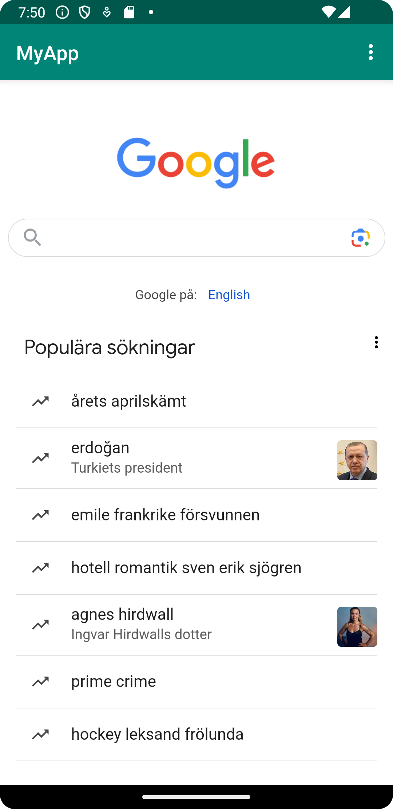

# Rapport

Till att börja med ändrade jag namn på appen i strings.xml. Se koden nedan.
```
<string name="app_name">MyApp</string>
```
Därefter möjliggjorde jag internetåterkomst i AndroidManifest.xml. Se koden nedan.
```
<uses-permission android:name="android.permission.INTERNET" />
```
Jag skapade ett WebView-element i activity_main.xml och raderade textView. Jag gav WebView ett ID,
my_webview. Se koden nedan.
 
```
    <WebView
        android:id="@+id/my_webview"
        android:layout_width="match_parent"
        android:layout_height="match_parent" />
```
Jag skapade en variabel "myWebView" i MainActivity.java som jag initierade i metoden
onCreate() genom att använda findViewById för att hämta den från activity_main.xml.
Se koden nedan.
```
    WebView myWebView;
    @Override
    protected void onCreate(Bundle savedInstanceState) {
        super.onCreate(savedInstanceState);
        setContentView(R.layout.activity_main);
        Toolbar toolbar = findViewById(R.id.toolbar);
        setSupportActionBar(toolbar);

        myWebView = findViewById(R.id.my_webview);
```
Jag skapade ett nytt WebViewClient-objekt i MainActivity.java i onCreate()-metoden 
och importerade klassen WebViewClient. Därefter la jag till WebViewClient till myWebView.
Se koden nedan.
```
       myWebView = findViewById(R.id.my_webview);
       myWebView.setWebViewClient(new WebViewClient());
       myWebView.loadUrl("https://his.se");
```
Därefter la jag till möjligheten att köra Javascript genom att använda getSettings() och
setJavaScriptEnabled() i metoden onCreate(). Jag behövde importera klassen WebSettings för 
detta. Jag verifierade att detta fungerade och såg att rutan försvann att Javascript saknades
när jag uppdaterade appen. Se koden nedan.
```
       WebSettings myWebSettings = myWebView.getSettings();
       myWebSettings.setJavaScriptEnabled(true);
```
Sedan skapade jag en assets-mapp där jag skapade en html-fil och la in en rubrik samt en paragraf
i html-filen about.html.

I MainActivity.java i metoderna showExternalWebPage() och showInternalWebPage() la jag in en extern
URL, https://google.com, och min about.html-fil som intern webbsida. Se koden nedan.
```
    public void showExternalWebPage(){
        myWebView.loadUrl("https://google.com");
    }

    public void showInternalWebPage(){
        myWebView.loadUrl("file:///android_asset/about.html");
    }
```
För att kalla på metoderna när "External Web Page" och "Internal Web Page" klickas på i
dropdown-menyn ändrade jag i if-satserna i metoden onOptionsItemSelected() och la till 
showExternalWebPage() och showInternalWebPage(). Se koden nedan.
```
        if (id == R.id.action_external_web) {
            Log.d("==>","Will display external web page");
            showExternalWebPage();
            return true;
        }

        if (id == R.id.action_internal_web) {
            Log.d("==>","Will display internal web page");
            showInternalWebPage();
            return true;
        }
```
Till sist använde jag den inbyggda funktionen för att ta skärmdumpar och tog en skärmdump av min
interna webbsida och en av min externa webbsida. Skärmdumparna finns bifogade i projektet.


Bilder läggs i samma mapp som markdown-filen.




